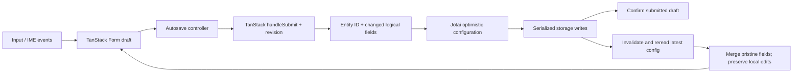

# Options autosave

Provider and Custom AI Action editors keep their editable values in TanStack Form.
`configAtom` is the shared optimistic configuration; it is not a persistence receipt.

## Controller and React integration

- `createAutosaveController` is independent of React and never stores the live input value.
- `useAutosave` binds current form/persistence callbacks and manages controller lifetime.
- `AutosaveContext` provides shared field operations. `useAutosaveState` subscribes through React's `useSyncExternalStore`.
- `edit(update, { immediate? })` executes updates synchronously. Text changes restart one 500ms timer; discrete changes request an immediate submission.
- `beginComposition` suspends pending submissions for the entire form. `endComposition` commits the final field value and resumes scheduling.
- `flush` waits for pending edits and returns `saved`, `unchanged`, `invalid`, or `failed`. A pending flush remains pending until composition ends.
- `commit(value, revision)` is called by TanStack's validated `onSubmit`. It rechecks the revision and composition state, snapshots the draft, and persists only changed logical fields.
- `discard` cancels scheduled work, waits for in-flight writes, and restores the latest configuration. Completed saves are not undone.

`busy` and `composing` are independent: a previous write may complete while the user composes a new word. Its acknowledgement only advances the saved baseline; it never resets the live draft. TanStack's `isDirty` records interaction history and is deliberately not used as the unsaved-changes indicator.

## Raw JSON editors

CodeMirror retains raw text independently because incomplete JSON cannot be represented by the parsed form value. A registered draft source supplies current text, parsing, acknowledgement and reset operations. Flush parses the latest text before TanStack validates the form. Invalid JSON blocks saving/navigation; successful writes preserve formatting and newer raw edits.

## Persistence and external updates

`ConfigUpdate` accepts legacy object patches or a pure updater. An updater is evaluated both for the optimistic state and against fresh storage when its queue turn executes. Updaters support explicit `undefined` to remove optional fields; legacy object patches retain their previous merge semantics.

Entity writes find the provider/action by ID, shallow-apply changed logical fields, and retain siblings and ordering. Nested models, JSON records and action schema/connection structures are atomic logical fields. Missing entities are rejected instead of recreated.

Storage notifications invalidate a read instead of applying their potentially old payload. Reads wait for local writes and check write/read generations before publishing. Initial load and visibility refresh use the same protection. This coordinates one extension context; simultaneous cross-context writes are not transactions.

## Navigation and lifetime

An active session registers through `AutosaveBoundary`. Validation messages remain next to their fields; persistence failures use an existing toast with Retry, without inserting a banner into the editor. Entity selection, creation and duplication use `requestEditorNavigationAtom`. The settings data router uses `useBlocker` to cover links, command navigation and history. A valid draft is flushed before proceeding; invalid/failed drafts remain mounted with an explicit continue-editing/discard choice.

The confirmed delete action discards pending edits and drains started writes before deleting. `beforeunload` only requests the browser's native warning while work is pending. Cleanup never starts a write. Draft recovery after a forced close, reload or crash is not provided.

## Verification

Controller tests cover timers, composition, async validation, delayed writes, retries, reconciliation, raw editors and disposal. Integration tests use real TanStack forms, Jotai and a data router. Storage tests mock only the adapter boundary. Browser checks use the built extension and compare input values against `chrome.storage.local`.

Synthetic composition events verify application event handling but do not replace a human test with an operating-system IME. Keep those two forms of evidence separate.
